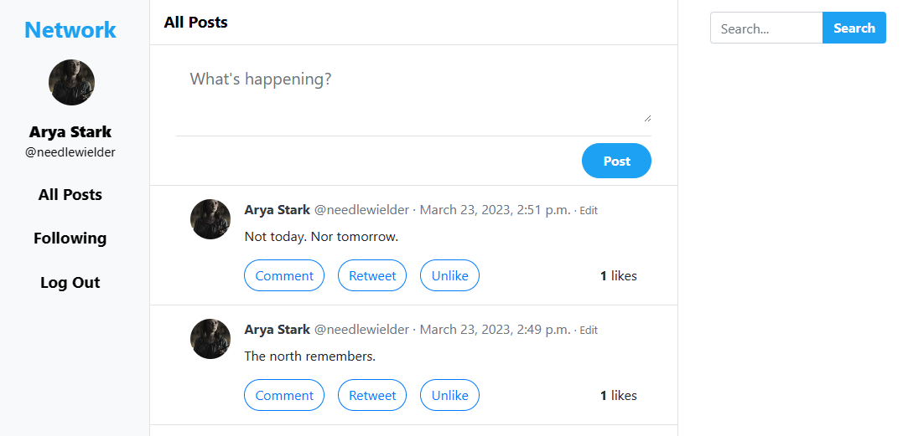
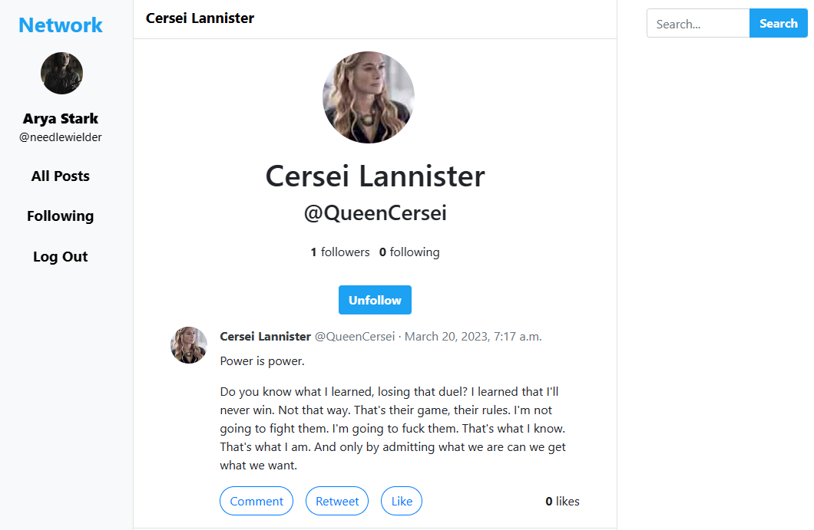

# Network
Social network website for making posts, following other users, liking posts, and searching users and their posts.

## Summary

The aim of this project was to build a Twitter-like social network website using the Python Django framework. Users can view all posts, as well as search on the site. New posts can be created by users, and users can edit their existing post. Users can can like a post, follow a user, and edit their profile.

[View the full assignment description on CS50's OpenCourseWare](https://cs50.harvard.edu/web/2020/projects/4/network/)

## Technologies
* Python Django
* Javascript
* HTML
* CSS
* Bootstrap

## Implementation.

### New Post
Users who are signed in can be able to write a new text-based post by filling in text into a text area and then clicking a button to submit the post.

### All Post
The “All Posts” link in the navigation bar takes the user to a page where they can see all posts from all users, with the most recent posts first.

Each post includes the username of the poster, the post content itself, the date and time at which the post was made, and the number of “likes” the post has and the profile picture of the user.

### Profile Page
Clicking on a username loads that user’s profile page. This page displays the number of followers the user has, as well as the number of people that the user follows. I also displays all of the posts for that user with the most recent posts first. 

For any other user who is signed in, this page also displays a “Follow” or “Unfollow” button that will let the current user toggle whether or not they are following the user. 

### Following Page
The “Following” link in the sidebar takes the user to a page where they see all posts made by users that the current user follows. This page should behave just as the “All Posts” page does, just with a more limited set of posts. This page is only be available to users who are signed in.

### Pagination
On any page that displays posts, posts are only displayed 10 on a page. If there are more than ten posts, a “Next” button appears to take the user to the next page of posts. If not on the first page, a “Previous” button would appear to take the user to the previous page of posts as well.

### Edit Post
Users can be able to click an “Edit” link on any of their own posts to edit that post. 

### “Like” and “Unlike”
Users can be able to click a button or link on any post to toggle whether or not they “like” that post. Using JavaScript, it asynchronously let the server know to update the like count (as via a call to fetch) and then update the post’s like count displayed on the page, without requiring a reload of the entire page.

## How to Run
1. Clone this repository, navigate to the project and type the following commands:
2. Install requirements (Django): `pip install -r requirements.txt`
3. Run the app locally: `python manage.py runserver`